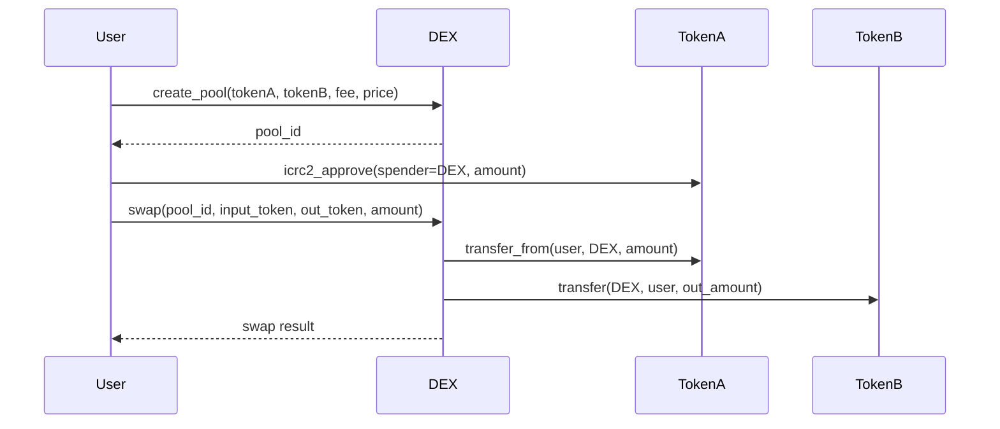
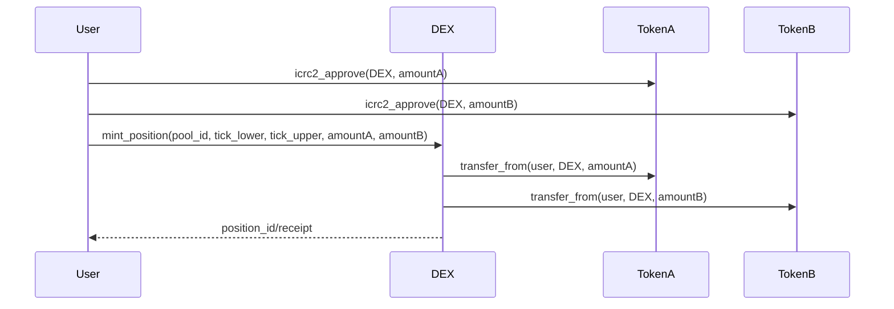
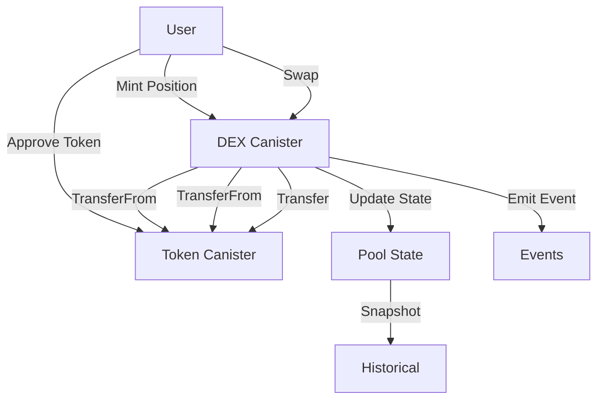

# Appic DEX – Code Structure, Flows, and Security

Appic DEX is a decentralized exchange written in Rust and deployed as a canister on the Internet Computer (ICP). It provides trustless, permissionless trading, liquidity management, and fee collection, leveraging the AMM (Automated Market Maker) model. Below is a deep-dive into the codebase, including module responsibilities, flow diagrams, and security mechanisms.

---

## 1. Core Directory & File Map

```
src/
├── balances/               # User balances, accounting, token transfer logic
├── candid_types/           # Candid IDL types for canister API
├── cbor/                   # Stable memory encoding/decoding (CBOR)
├── events/                 # Event logging (swaps, liquidity, etc.)
├── guard/                  # Principal-based guards/locks (access control)
├── historical/             # Historical pool and trade data
├── icrc_client/            # ICRC (token standard) integrations
├── libraries/              # Misc. reusable utilities
├── pool/                   # AMM pool logic (liquidity, swaps, math)
├── position/               # User liquidity positions (mint/burn, fees)
├── state/                  # Canister-wide state management
├── tick/                   # Tick/range primitives for concentrated liquidity
├── validation/             # Input/state validation logic
├── lib.rs                  # Exports core library API
├── logs.rs                 # Logging helper
├── main.rs                 # Canister entry, public API, setup
├── mint.rs                 # Add liquidity (mint position)
├── burn.rs                 # Remove liquidity (burn position)
├── increase_liquidity.rs   # Add more liquidity to a position
├── decrease_liquidity.rs   # Remove some liquidity from a position
├── quote.rs                # Price/amount quoting
├── swap.rs                 # Swap execution
├── tests/                  # Unit/integration tests
appic_dex.did               # Candid interface for canister
Cargo.toml, dfx.json, makefile
```

---

## 2. Module Deep-Dive

### **A. Pool Logic (`pool/`, `tick/`, `state/`)**

- Implements AMM pools (like Uniswap V3).
- Pools are created with two tokens, fee tier, and initial price.
- Ticks represent price boundaries for concentrated liquidity.
- Pools track reserves, liquidity, tick state, and accrued fees.

**Flow: Pool Creation & Swap**


### **B. Position Management (`position/`, `mint.rs`, `burn.rs`, `increase_liquidity.rs`, `decrease_liquidity.rs`)**

- Users add liquidity by minting a position in a price range (tick_lower, tick_upper).
- Positions accrue fees.
- Users can increase, decrease, burn positions, and collect fees.

**Flow: Minting Liquidity**


### **C. Token Interaction (`icrc_client/`)**

- Abstracts ICRC-1/2 (Internet Computer token standard) calls:
    - `icrc2_approve` for allowance.
    - `transfer_from`, `transfer` for moving tokens.
- Ensures atomicity and correct error handling for token operations.

### **D. Event Logging (`events/`)**

- All major changes (swap, mint, burn) emit events.
- Events are queryable for analytics/auditing.

### **E. Historical Data (`historical/`)**

- Periodically snapshots pool state for analytics.
- Enables historical queries for charting, analysis.

### **F. Validation (`validation/`)**

- Validates all user input (amounts, ticks, permissions).
- Prevents invalid or malicious actions at the API boundary.

---

## 3. Security Mechanisms

### **A. Principal Guards (`guard/`)**

**Purpose:**  
Prevents concurrent or repeated operations (like double-spend) by the same principal.

**Implementation:**
- Uses a thread-local `HashSet` to track principals with ongoing operations.
- *Swap* operations can run concurrently if they have unique swap numbers.
- All other operations for a user are mutually exclusive.
- Dropping a guard cleans up the lock.
- Returns specific errors if a principal is already processing another action.

**Example:**
```rust
// src/guard/mod.rs
/// Prevents double-spending, ensures lock per principal
pub struct PrincipalGuard { /* ... */ }
thread_local! {
    static GUARDED_PRINCIPALS: RefCell<HashSet<Guard>> = RefCell::new(HashSet::default());
}
```
- Extensively tested (see `src/guard/tests.rs`).

### **B. Input Validation (`validation/`)**

- All user actions are checked for correctness (amounts > 0, valid ticks, pool exists).
- Only valid Candid types and principal identities accepted.
- `main.rs` validates that all callers are authenticated (not anonymous).

### **C. Memory Safety, Concurrency, and Error Handling**

- **Rust Safety:** All code is Rust, with strict typing and borrow checker to prevent memory bugs.
- **CBOR for Stable Memory:** Uses CBOR for compact, reliable data persistence across canister upgrades.
- **Error Handling:** Errors are explicitly returned in all token operations, swaps, and liquidity management.
- **Event Logging:** All state changes are logged for post-mortem analysis and to detect anomalies.

### **D. Permission Model**

- Only explicitly approved principals can spend user tokens.
- Uses ICRC2's approve and transfer_from model.
- Guards and validation ensure a user cannot perform overlapping state changes.

### **E. Additional Security Best Practices**

- Follows [ICP Security Best Practices](https://internetcomputer.org/docs/building-apps/security/overview).
- Encourages security audits (see README security section).
- Rust's memory model further prevents race conditions and buffer overflows.
- Responsible disclosure for vulnerabilities.

---

## 4. Additional Diagrams

**AMM Liquidity/Swap Flow**


---

## 5. Testing & Integration

- `src/tests/` contains both unit and integration tests.
- Integration tests simulate full flows: canister setup, pool creation, swap, liquidity changes, token approvals, etc.
- Test utilities provide mock actors (principals), canister deployment, and state assertions.

---

## 6. References

- [Pool and Position Management Guide](./pool.md)
- [Swapping Guide](./swap.md)
- [DEX Queries Guide](./queries.md)
- [Candid Interface](appic_dex.did)
- [ICP Security Best Practices](https://internetcomputer.org/docs/building-apps/security/overview)

---

## 7. License

Apache-2.0

---

*For further questions, consult the guides or specific module documentation and tests in the codebase.*
